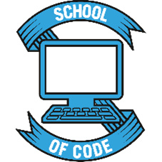

## Hi there, I'm James 👋

I am a full-stack developer from Worcestershire (UK), recent graduate of the [School of Code](https://www.schoolofcode.co.uk/) 16 week bootcamp, and student with the [Open University](http://www.open.ac.uk/courses/computing-it/degrees/bsc-computing-it-software-q62-soft) studying the final year of a Computing & IT degree 🎓.

I have a background in heavy goods transport and discovered the world of coding when I embarked on my journey with the Open University, now I am working my way towards a career as a developer and helping to solve problems through tech!

My GitHub repo's feature projects I created through my own learning as well as projects created while working in an agile team with the School of Code. I generally always have a project a on the go!

You can also find me on [LinkedIn](https://www.linkedin.com/in/jimbowler82/), [Twitter](https://twitter.com/JimBowler82), and my personal [website](https://www.jamesbowler.co.uk).

Feel free to get in touch!

- 🔭 I’m currently working on - [The Todo Project](https://github.com/JimBowler82/theTodoProject-Client) - A MERN stack project _(Mongo, Express, React, Node)_
- 🌱 I’m currently learning - _**Docker & AWS**_
- 💬 Ask me about - **Any questions you might have (_School of Code, Open Univeristy, projects, JavaScript ..._)**
- 📫 How to reach me: - **See links above!**

